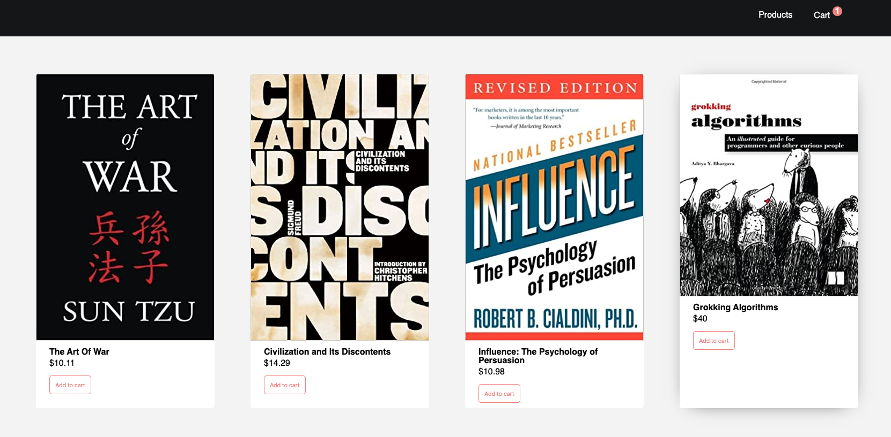

# Project: Context API - Shopping Cart

Refactor a e-commerce store to use `Context API` as well as extend the functionality of the application making it more robust!

**Step 1 - Add item functionality**

**STEP 2 - Creating ProductContext**

**STEP 3 - Providing data with ProductContext**

**STEP 4 - Consuming data with ProductContext**

**STEP 5 - Create the CartContext**

**STEP 6 - Providing data with CartContext**

**STEP 7 - Consuming data with CartContext**

